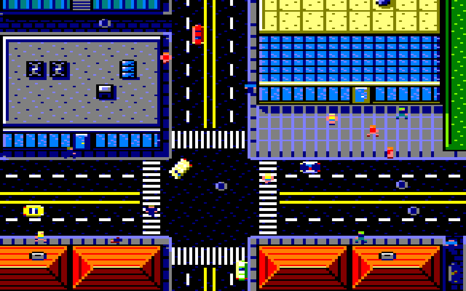
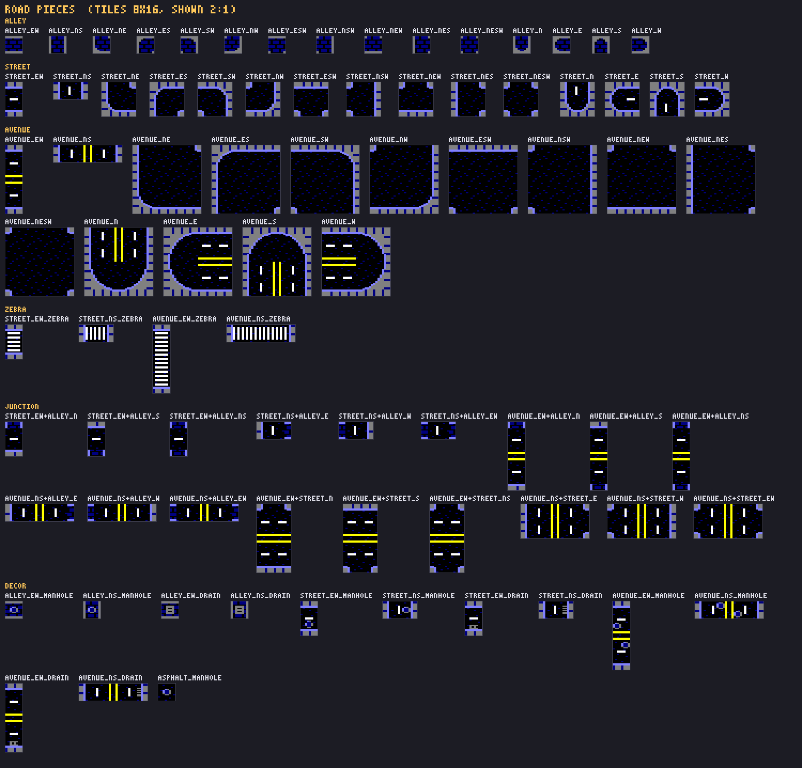
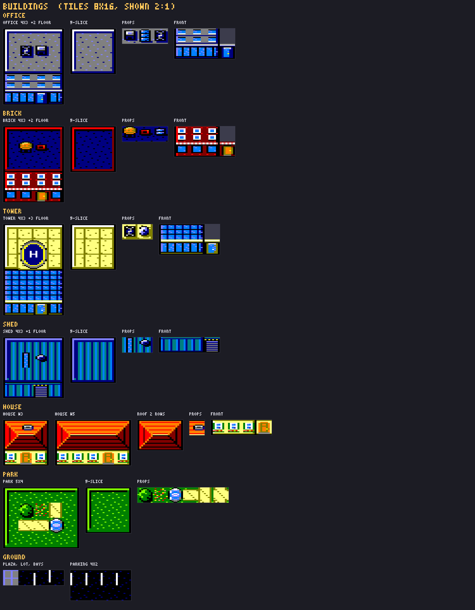
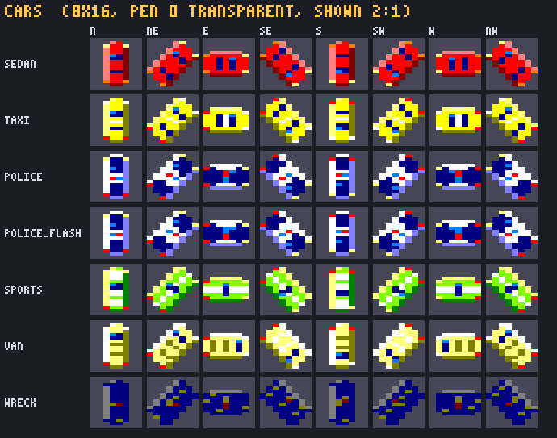
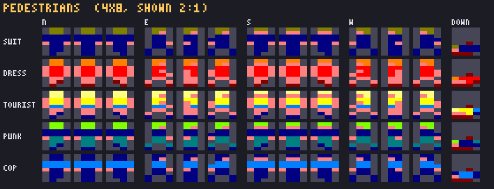

# GTA — top-down πόλη για Amstrad CPC Mode 0

Πλήρες γραφικό πακέτο για παιχνίδι top-down πόλης τύπου Grand Theft Auto 1, φτιαγμένο για
**Mode 0** του Amstrad CPC: 160×200 pixels, 16 pens, pixels με αναλογία 2:1.

Όλα τα tiles είναι **8×16 pixels Mode 0**, δηλαδή τετράγωνα στην οθόνη (16×16 «μονάδες») και
64 bytes το καθένα. Τα sprites (αυτοκίνητα, πεζοί) έχουν pen 0 διάφανο.
Όλα παράγονται από τον generator στο `src/` και υπάρχουν και ως `.aseprite` για να τα πειράξεις με το χέρι.



*Μία οθόνη 160×200 από το mockup (σχεδιασμένη με pixels 2:1). Ολόκληρη η πόλη: [`mockup_city.png`](mockup_city.png).*

## Τι περιέχει

| Αρχείο | Περιεχόμενο |
|---|---|
| `roads_cpc_mode0.aseprite` / `_sheet.png` / `_sheet.json` | 89 tiles δρόμων (μαζί με φρεάτια), tags ανά ομάδα |
| `buildings_cpc_mode0.aseprite` / `_sheet.png` / `_sheet.json` | 105 tiles κτηρίων, πάρκου, πλατείας/πάρκινγκ |
| `shadows_cpc_mode0.aseprite` / `_sheet.png` / `_sheet.json` | 52 σκιασμένα tiles εδάφους (σκιές κτηρίων) |
| `cars_cpc_mode0.aseprite` / `_sheet.png` / `_sheet.json` | sprites αυτοκινήτων 8×16: 7 tags × 8 κατευθύνσεις |
| `peds_cpc_mode0.aseprite` / `_sheet.png` / `_sheet.json` | sprites πεζών 4×8: 5 τύποι × (4 κατευθύνσεις × 3 καρέ + πεσμένος) |
| `road_pieces.json` | 80 κομμάτια δρόμου (metatiles) → πίνακες δεικτών tiles |
| `building_kit.json` | 9-slice οροφές, props, προσόψεις ανά στυλ |
| `shadow_table.json` | ποιο tile + ποια μάσκα σκιάς → ποιο σκιασμένο tile, οι μάσκες και η αντιστοίχιση χρωμάτων |
| `tile_table.json` | όνομα/tag/δείκτης κάθε tile και ενιαίος δείκτης (δρόμοι, κτήρια, σκιές) |
| `manifest.json` | σύνοψη όλου του πακέτου: παλέτα, sheets, sprites, μεγέθη, μνήμη |
| `mockup_city.png`, `mockup_screen.png` | όλη η πόλη και μία οθόνη CPC (160×200) |
| `mockup_city_tilemap.aseprite`, `mockup_city_map.json` | ο ίδιος χάρτης ως tilemap του Aseprite / ως δείκτες |
| `preview_*.png` | κατάλογοι κομματιών, tiles με δείκτες και sprites (αναλογία 2:1) |
| `src/` | ο generator (`python src/make_all.py` τα ξαναφτιάχνει όλα) |

Ο ενιαίος δείκτης tiles: δρόμοι 0–88, κτήρια 89–193, σκιές 194–245.
Και τα τρία sheets μαζί: 246 tiles = 15.744 bytes, χωράνε σε χάρτη με δείκτες 1 byte
(περισσεύουν 10 θέσεις για σκιές από δικούς σου χάρτες).

## Πλάτη δρόμων

1 tile = 16×16 «μονάδες» στην οθόνη, περίπου όσο ένα αυτοκίνητο σε μήκος.

- **Στενάκι** (`alley`): 1 tile. Λιθόστρωτο 12 μονάδων με στενό γκρι πεζοδρομάκι 2 μονάδων κάθε πλευρά, μία λωρίδα, χωρίς διαγράμμιση.
- **Δρόμος με πεζοδρόμια** (`street`): 2 tiles. Πεζοδρόμιο 6 (με κράσπεδο) + 2 λωρίδες των ~10 + διακεκομμένη στη μέση.
- **Κεντρική οδός** (`avenue`): 4 tiles. Πεζοδρόμιο 6 + 2+2 λωρίδες των 10 + διπλή κίτρινη.

Τα 3 tiles για κεντρική οδό θα έδιναν ή λωρίδες στενότερες από τον δρόμο των 2 tiles ή
χωρίς διπλή κίτρινη, γι' αυτό επιλέχθηκαν 4.

## Κομμάτια δρόμων



Όνομα = `τύπος_πλευρές`, με τις πλευρές που ανοίγει το κομμάτι σε σειρά N E S W:
`EW`/`NS` ευθεία (1 tile μήκος, επαναλαμβάνεται), `NE` `ES` `SW` `NW` στροφές,
`ESW` `NSW` `NEW` `NES` διασταυρώσεις σε T, `NESW` σταυροδρόμι, `N` `E` `S` `W` αδιέξοδα (ανοιχτά σ' εκείνη την πλευρά).
Επιπλέον `*_zebra` (διάβαση πεζών) και κόμβοι διαφορετικών τύπων, π.χ. `avenue_EW+street_N`
(δρόμος που βγαίνει βόρεια από κεντρική οδό) ή `street_NS+alley_EW` (στενάκι που διασχίζει δρόμο).

### Φρεάτια

Κομμάτια της ομάδας `decor` που μπαίνουν στη θέση μιας ευθείας: `*_manhole` (καπάκι στη λωρίδα) και
`*_drain` (σχάρα υδροσυλλογής στο κράσπεδο· στο στενάκι σχάρα στη μέση), για στενάκι, δρόμο και κεντρική,
οριζόντια και κάθετα, και `asphalt_manhole` (σκέτη άσφαλτος με καπάκι) για το κέντρο των κόμβων.
Στους δρόμους και στις κεντρικές τα φρεάτια είναι στη νότια/ανατολική πλευρά, όπου δεν πέφτει ποτέ σκιά κτηρίου,
ώστε να μη χρειάζονται σκιασμένες εκδοχές.

## Κτήρια



Κάθε κτήριο αποτελείται από την οροφή και έναν τοίχο πρόσοψης στη νότια πλευρά του (ελαφριά ματιά 3/4, φως από πάνω αριστερά).
Επίπεδες οροφές (office, brick, tower, shed, park) = 9-slice, οποιοδήποτε μέγεθος ≥ 2×2. Τα props (κλιματιστικά, δεξαμενή νερού,
φεγγίτες, δορυφορικό πιάτο, ελικοδρόμιο 2×2, δέντρα, σιντριβάνι, μονοπάτια) μπαίνουν στη θέση ενός `c` tile.
Κάτω από την οροφή μπαίνουν 0+ σειρές `up` (όροφοι) και μία σειρά `ground` (με `door`).
Τα σπίτια έχουν κεραμοσκεπή 2 σειρών και μία σειρά τοίχου.

## Σκιές

Φως από πάνω αριστερά: κάθε κτήριο (οροφή + πρόσοψη, όχι το πάρκο) ρίχνει σκιά 6 μονάδες δεξιά και 6 κάτω,
όσο δηλαδή το πλάτος του πεζοδρομίου. Η σκιά είναι μια λωρίδα στην ανατολική πλευρά, που αρχίζει με λοξή κοπή στην κορυφή,
μια λωρίδα κάτω από την πρόσοψη και ένα τετράγωνο στη ΝΑ γωνία. Πέφτει μόνο σε έδαφος (δρόμοι, πλατεία,
πάρκινγκ, πάρκο), ποτέ πάνω σε άλλο κτήριο. Επειδή σταματά στο κράσπεδο, η άσφαλτος δεν αλλάζει.

Σκιασμένο tile = το tile εδάφους με τα pixels της μάσκας σε πιο σκούρο pen (γκρι→μπλε, μπλε→μαύρο, λευκό→γκρι…).
Μάσκες: `E_top`, `E`, `SE`, `S_left`, `S`. Το tag `shadow_common` καλύπτει τα πεζοδρόμια των ευθειών και το ανοιχτό έδαφος,
και το `shadow_mockup` τις γωνίες κόμβων, τις άκρες του πάρκου και τα στενάκια με φρεάτια που χρειάστηκε το mockup.

Για δικούς σου χάρτες:

```
python src/make_all.py --map level1.json
```

Το `level1.json` είναι `{"rows": [[...]]}` με ενιαίους δείκτες δρόμων/κτηρίων χωρίς σκιές, π.χ. το `base_rows` του
`mockup_city_map.json`. Οι σκιές που λείπουν προστίθενται στο τέλος του sheet σκιών, οπότε οι υπάρχοντες δείκτες
δεν αλλάζουν, και γράφεται το `level1_shadowed.json`.

## Αυτοκίνητα



8×16 (όσο ένα tile)· το αμάξι είναι 14×8 μονάδες, οπότε χωράει σε λωρίδα των 10.
Tags: `sedan`, `taxi`, `police`, `police_flash`, `sports`, `van`, `wreck`, με 8 καρέ το καθένα —
N NE E SE S SW W NW (δεξιόστροφα από τον βορρά).

- Τα SW/W/NW είναι ακριβείς καθρέφτες των SE/E/NE, οπότε η μηχανή μπορεί να κρατά 5 κατευθύνσεις
  και να αναστρέφει (για Mode 0 θέλει πίνακα 256 bytes που αντιμεταθέτει τα 2 pixels κάθε byte).
- Sedan, ταξί, περιπολικό και καμένο έχουν το ίδιο σχήμα με άλλα pens: μπορείς να κρατάς ένα σχήμα και να αλλάζεις χρώματα.
- Σειρήνα = εναλλαγή `police` / `police_flash` (αλλάζουν μόνο τα 2 pixels της μπάρας).
- Άγκυρα: το κέντρο του καρέ.

## Πεζοί



4×8, τύποι `suit`, `dress`, `tourist`, `punk`, `cop`. Σε αυτό το μέγεθος ένας άνθρωπος από ακριβώς πάνω
γίνεται μια κουκκίδα, γι' αυτό οι πεζοί είναι σε ελαφριά ματιά 3/4 (κεφάλι πάνω, πόδια κάτω),
όπως και οι προσόψεις των κτηρίων.

- Tags `<τύπος>_N/E/S/W` με 3 καρέ [βήμα, στάση, άλλο βήμα] σε ping-pong (160 ms).
- `<τύπος>_down` = πεσμένος, με αίμα.
- Το W είναι καθρέφτης του E· στις διαγώνιες χρησιμοποίησε E/W.
- Άγκυρα: ανάμεσα στα πόδια (κάτω κέντρο).

### Μνήμη sprites

| | Καρέ | Με μάσκα | Σύνολο με μάσκα |
|---|---|---|---|
| Αυτοκίνητο 8×16 | 64 bytes | 128 bytes | 640 bytes ανά μοντέλο (5 κατευθύνσεις) |
| Πεζός 4×8 | 16 bytes | 32 bytes | 320 bytes ανά τύπο (10 καρέ) |

Στα sprites το pen 0 είναι διάφανο και από αυτό βγαίνει η μάσκα (όπως στο `cpc_heroine`), άρα το πιο
σκούρο ορατό τους χρώμα είναι το μπλε (pen 1). Τα sprite sheets είναι εξαγμένα με μία σειρά ανά tag·
τα tile sheets σε 8 στήλες.

## Παλέτα (pen → firmware ink)

| | | | |
|---|---|---|---|
| 0 Black 0 | 1 Blue 1 | 2 Grey 13 | 3 Bright White 26 |
| 4 Bright Yellow 24 | 5 Yellow 12 | 6 Red 3 | 7 Bright Red 6 |
| 8 Orange 15 | 9 Green 9 | 10 Lime 21 | 11 Sky Blue 11 |
| 12 Pastel Blue 14 | 13 Pastel Yellow 25 | 14 Cyan 10 | 15 Pink 16 |

## Ξαναφτιάξιμο

```
python src/make_all.py
```

Χρειάζεται μόνο Python (χωρίς εξαρτήσεις) και το Aseprite για την εξαγωγή των `.aseprite` / sheets —
από το `$ASEPRITE` ή από το `../../build/bin/aseprite.exe`. Τα σχέδια είναι κείμενο μέσα στα
`src/roads.py`, `src/buildings.py` και `src/sprites.py`, οπότε αλλάζουν εύκολα.
